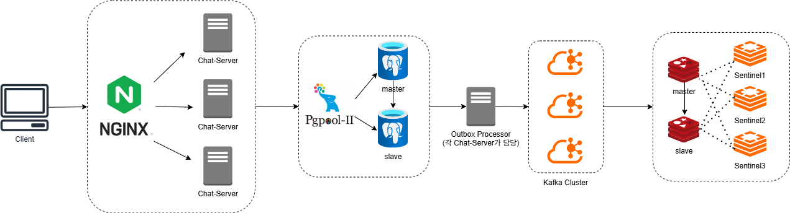

# chat-scalable
확장성과 내결함성을 갖춘 WebFlux 기반 채팅 웹 서버 구현(Redis, Kafka 사용)

<pre><code>```
[chat-react]
    └── STOMP 없이 구현한 간단한 채팅 클라이언트 

[chat-bot]
    └── STOMP 제거 버전의 시뮬레이션용 부하 테스트 봇

[chat-webflux]
    └── 비상태(Stateless) 구조의 Spring WebFlux + Netty 기반 채팅 서버

[chat-infra] 
    └── Redis, PostgreSQL, Kafka 등 인프라 구성 스크립트
```</code></pre>


## 프로젝트 개요
[이전 프로젝트](https://github.com/gr1993/chat-service)에서는 MVC와 WebFlux 기반의 채팅 웹 서버를 구현하고, 해당 서버에 대해 성능 테스트를   
진행하였다. 당시 구현한 웹 서버는 메모리에 상태를 유지하는 모놀리식 아키텍처로 설계되었었다.  
이번 프로젝트에서는 확장성을 고려한 비상태(Stateless) WebFlux 기반의 채팅 서버를 구축할 예정이다.  
서버의 상태는 Redis, RDBMS와 Kafka에 저장하며, 이를 통해 더 높은 처리량을 지원하는 시스템을 구현하고자 한다.  
이러한 구성은 확장성과 내결함성(Fault Tolerance)에 대한 이해를 높이기 위한 목적도 포함하고 있다.  

### 다중 채팅 서버간 채팅 메시지 공유
이번에는 STOMP 기술을 제거하고 WebSocket만을 사용하며, Kafka의 메시징 시스템을 활용하여 채팅 메시지를  
여러 서버가 실시간으로 공유하는 구조를 구현할 예정이다. 따라서 채팅 메시지가 들어오면, 우선 Kafka 토픽에  
발행한다. 각 서버는 이 토픽을 구독하여 메시지를 소비하고, 각 서버의 메모리에 Room ID별로 저장된 웹소켓  
연결 정보를 확인한다. 이후 해당 채팅방에 있는 사용자들에게만 메시지를 보내도록 처리할 것이다.

### 백엔드 기술
* Spring Boot 3.5.5 (JDK 21)
* Spring Webflux 6.2.10
* r2dbc
  * r2dbc-postgresql
  * r2dbc-h2 : 테스트 전용 R2DBC 드라이버
* redis
  * redis-reactive
  * redisson : 분산 락 사용할 Redis Client
  * embedded-redis
* kafka
  * reactor-kafka
  * spring-kafka-test : @EmbeddedKafka 사용

### 기능별 쓰기 절차
RDBMS와 Kafka 간 데이터 일관성을 보장하기 위해 Transactional Outbox Pattern을 적용할 예정이다.  
Outbox 테이블의 대기 메시지는 Polling 방식으로 감지할 예정이며,  
이 과정은 다중 서버 환경에서 하나의 서버만 처리해야 하는 로드밸런싱 방식으로 동작해야 한다.  
이를 위해 **Redis 기반의 분산 락(Distributed Lock)**을 적용할 예정이다.  

Redis는 쓰기 작업 전에 정합성을 검증하기 위한 조회 용도로는 적합하지 않다. 이는 쓰기 작업에서 데이터의  
일관성과 정확성이 중요하기 때문이다. 따라서 Redis를 읽기 캐시로 사용하는 로직은 구현하지 않으며,  
Kafka 메시지를 소비하는 비즈니스 로직 내에서 Redis에 데이터를 저장하는 용도로만 사용할 예정이다.  

* 로그인
  * 아이디만 입력하는 간단한 절차로, 존재하지 않는 아이디의 경우 회원가입이 가능하다.
  * 회원가입은 중요도가 높고 발생 빈도가 낮은 이벤트이므로, RDBMS에 먼저 저장하여 강한 일관성을 확보하고, 이후 Kafka를 통해 이벤트를 발행하고 Redis 등에 캐싱 처리한다.
* 채팅방
  * 채팅방 정보 또한 먼저 RDBMS에 저장한 뒤, Kafka에 이벤트를 발행하여 Redis 캐싱, 알림 전송 등 후속 처리를 비동기적으로 수행한다.
* 채팅메시지
  * 채팅 메시지는 실시간성과 처리량이 중요한 이벤트이므로, Kafka에 우선 발행하여 메시지를 처리하고, 이후 Redis 및 RDBMS에 비동기적으로 저장한다.

### Kafka 동작 방식
웹 서버는 3대 이상의 다중 서버로 구성될 예정이며, group-id를 동일하게 설정할 경우 Consumer Group으로  
묶이게 된다. 이때 그룹 내에서는 파티션 수만큼 병렬 처리가 가능하지만, 하나의 메시지는 하나의 파티션에만  
저장되고 해당 파티션은 단 하나의 Consumer만 소비한다.  
따라서 기본적으로 Fan-out 방식이 아닌 **로드밸런싱(분산 처리) 방식으로 동작**한다.  

회원가입, 채팅방 생성 등 Kafka 메시지 소비 후 저장 로직은 로드밸런싱이 필요한 영역이므로 기본 Consumer  
설정(group-id 동일)을 그대로 사용한다. 반면, 채팅 메시지 중계용 Consumer는 모든 서버가 동일 메시지를  
수신해야 하므로 group-id를 랜덤하게 설정하여(Fan-out 방식) 별도의 전용 Consumer로 처리할 예정이다.  


## 아키텍처 구성도


### 저장소 구축 및 복제 구성 정리 블로그
* PostgreSQL
  * [Replication 구성하기](https://www.notion.so/Replication-27182094ef0a80cfbe96cf02ea555347)
  * [Failover(HA)와 Proxy Layer 구성하기](https://www.notion.so/Failover-HA-Proxy-Layer-27382094ef0a8083a27cde09c887c543)
* Redis
  * 이번 프로젝트에서는 Redis Sentinel 방식으로 구축
  * [Redis Sentinel 구축](https://little-pecorino-c28.notion.site/Redis-Sentinel-26282094ef0a8053bff4d836e771ecfd)
  * [Redis Cluster 구축](https://little-pecorino-c28.notion.site/Redis-Cluster-27082094ef0a80a0b574eb114c25398f)
* Kafka
  * [Kafka Cluster 구축](https://little-pecorino-c28.notion.site/Kafka-Zookeeper-Kraft-1a682094ef0a8048b229cc8fcef02e73)