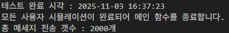
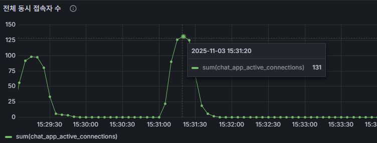
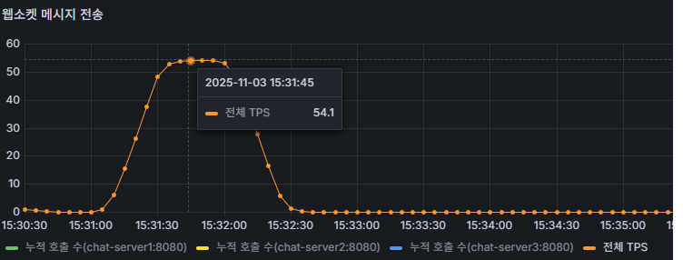
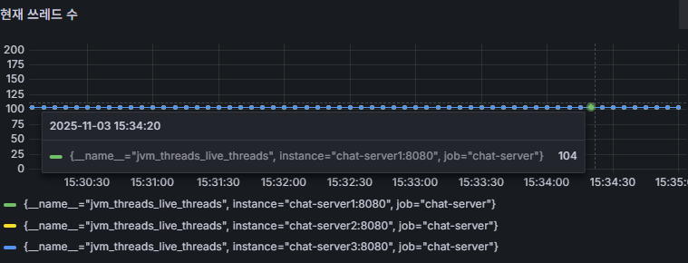

# chat-scalable
확장성과 내결함성을 갖춘 WebFlux 기반 채팅 웹 서버 구현(Redis, Kafka 사용)

<pre><code>```
[chat-react]
    └── STOMP 없이 구현한 간단한 채팅 클라이언트 

[chat-bot]
    └── STOMP 제거 버전의 시뮬레이션용 부하 테스트 봇

[chat-webflux]
    └── 비상태(Stateless) 구조의 Spring WebFlux + Netty 기반 채팅 서버

[chat-monitoring]
    └── Prometheus, Grafana 등 모니터링 설정

[chat-infra] 
    └── Redis, PostgreSQL, Kafka 등 인프라 구성 스크립트
```</code></pre>


## 프로젝트 개요
[이전 프로젝트](https://github.com/gr1993/chat-service)에서는 MVC와 WebFlux 기반의 채팅 웹 서버를 구현하고, 해당 서버에 대해 성능 테스트를   
진행하였다. 당시 구현한 웹 서버는 메모리에 상태를 유지하는 모놀리식 아키텍처로 설계되었었다.  
이번 프로젝트에서는 확장성을 고려한 비상태(Stateless) WebFlux 기반의 채팅 서버를 구축할 예정이다.  
서버의 상태는 Redis, RDBMS와 Kafka에 저장하며, 이를 통해 더 높은 처리량을 지원하는 시스템을 구현하고자 한다.  
이러한 구성은 확장성과 내결함성(Fault Tolerance)에 대한 이해를 높이기 위한 목적도 포함하고 있다.  

### 다중 채팅 서버간 채팅 메시지 공유
이번에는 STOMP 기술을 제거하고 WebSocket만을 사용하며, Kafka의 메시징 시스템을 활용하여 채팅 메시지를  
여러 서버가 실시간으로 공유하는 구조를 구현할 예정이다. 따라서 채팅 메시지가 들어오면, 우선 Kafka 토픽에  
발행한다. 각 서버는 이 토픽을 구독하여 메시지를 소비하고, 각 서버의 메모리에 Room ID별로 저장된 웹소켓  
연결 정보를 확인한다. 이후 해당 채팅방에 있는 사용자들에게만 메시지를 보내도록 처리할 것이다.

### 기능별 쓰기 절차
RDBMS와 Kafka 간 데이터 일관성을 보장하기 위해 Transactional Outbox Pattern을 적용할 예정이다.  
Outbox 테이블의 대기 메시지는 Polling 방식으로 감지할 예정이며,  
이 과정은 다중 서버 환경에서 하나의 서버만 처리해야 하는 로드밸런싱 방식으로 동작해야 한다.  
이를 위해 **Redis 기반의 분산 락(Distributed Lock)**을 적용할 예정이다.  

Redis는 쓰기 작업 전에 정합성을 검증하기 위한 조회 용도로는 적합하지 않다. 이는 쓰기 작업에서 데이터의  
일관성과 정확성이 중요하기 때문이다. 따라서 Redis를 읽기 캐시로 사용하는 로직은 구현하지 않으며,  
Kafka 메시지를 소비하는 비즈니스 로직 내에서 Redis에 데이터를 저장하는 용도로만 사용할 예정이다.  

* 로그인
  * 아이디만 입력하는 간단한 절차로, 존재하지 않는 아이디의 경우 회원가입이 가능하다.
  * 회원가입은 중요도가 높고 발생 빈도가 낮은 이벤트이므로, RDBMS에 먼저 저장하여 강한 일관성을 확보하고, 이후 Kafka를 통해 이벤트를 발행하고 Redis 등에 캐싱 처리한다.
* 채팅방
  * 채팅방 정보 또한 먼저 RDBMS에 저장한 뒤, Kafka에 이벤트를 발행하여 Redis 캐싱(로드밸런싱)을 처리 후 알림 전송(브로드캐스트) 등 후속 처리를 비동기적으로 수행한다.
* 채팅 메시지
  * 채팅 메시지는 실시간성과 처리량이 중요한 이벤트이므로, Outbox 테이블을 이용하지 않을 것이며, Kafka의 알림 토픽과 생성 토픽(RDBMS 및 Redis 캐싱용)에 동시에 발행하여 처리한다.

### Kafka 동작 방식
웹 서버는 3대 이상의 다중 서버로 구성될 예정이며, group-id를 동일하게 설정할 경우 Consumer Group으로  
묶이게 된다. 이때 그룹 내에서는 파티션 수만큼 병렬 처리가 가능하지만, 하나의 메시지는 하나의 파티션에만  
저장되고 해당 파티션은 단 하나의 Consumer만 소비한다.  
따라서 기본적으로 Fan-out 방식이 아닌 **로드밸런싱(분산 처리) 방식으로 동작**한다.  

회원가입, 채팅방 생성 등 Kafka 메시지 소비 후 저장 로직은 로드밸런싱이 필요한 영역이므로 기본 Consumer  
설정(group-id 동일)을 그대로 사용한다. 반면, 채팅 메시지 중계용 Consumer는 모든 서버가 동일 메시지를  
수신해야 하므로 group-id를 랜덤하게 설정하여(Fan-out 방식) 별도의 전용 Consumer로 처리할 예정이다.  

#### Kafka 토픽의 오프셋이 2씩 오르는 현상
Kafka UI로 확인해본 결과 토픽에 Message Count와 Offset이 1번 발행할 때 2씩 올라가는 현상이 발생하였다.  
알고보니 **Kafka 트랜잭션** 기능을 사용하면 제어 배치라는 특수 레코드가 로그에 추가되기 때문에 2씩 증가한다고  
한다. Kafka UI에서 특수 레코드가 노출되지는 않지만 트랜잭션 없이 발행하면 1씩 증가함을 확인하였다.

트랜잭션 없이 메시지 발행 명령어
```shell
docker exec -it kafka1 kafka-console-producer --bootstrap-server kafka1:9091 --topic chat.message.created
```


## 아키텍처 구성도


### 저장소 구축 및 복제 구성 정리 블로그
* PostgreSQL
  * [Replication 구성하기](https://www.notion.so/Replication-27182094ef0a80cfbe96cf02ea555347)
  * [Failover(HA)와 Proxy Layer 구성하기](https://www.notion.so/Failover-HA-Proxy-Layer-27382094ef0a8083a27cde09c887c543)
* Redis
  * 이번 프로젝트에서는 Redis Sentinel 방식으로 구축
  * [Redis Sentinel 구축](https://little-pecorino-c28.notion.site/Redis-Sentinel-26282094ef0a8053bff4d836e771ecfd)
  * [Redis Cluster 구축](https://little-pecorino-c28.notion.site/Redis-Cluster-27082094ef0a80a0b574eb114c25398f)
* Kafka
  * [Kafka Cluster 구축](https://little-pecorino-c28.notion.site/Kafka-Zookeeper-Kraft-1a682094ef0a8048b229cc8fcef02e73)


## 성능테스트 결과
이전 프로젝트와 마찬가지로 다중 웹서버들을 제한된(CPU, 메모리) 환경으로 구동하였다.  
사용자 수는 10개 단위로 증가시켰으며, 메시지 생성 시간은 20초로 설정하였다. 성능테스트 결과는 아래와 같다.  

### 최대 접속자 수




100명의 동시 접속까지 메시지 유실없이 처리가 가능하였다. (위 이미지는 150명 시뮬레이션 실패)  
이전 프로젝트와 비교했을 때, 메모리 기반 저장 방식에서 지속성을 가진 저장 방식으로 변경하고, Kafka 등 여러  
단계를 거치도록 비즈니스 로직이 크게 달라졌다. 그 결과, 다중 서버 환경임에도 불구하고 이전 프로젝트보다 성능이  
상대적으로 낮게 나타났다. (이전 프로젝트는 최대 600명 까지 처리가 가능했음)  

### 메시지 처리량



tps도 최대 접속자 수 지표에 비례하여 매우 저조한 처리량이 나온것을 확인할 수 있었다.

### 쓰레드 수



이전 프로젝트는 쓰레드 수가 14개 정도를 유지했었는 데, 이번에는 RDBMS, Redis, Kafka 등 외부 저장소와  
연결을 유지해야 하는 특성으로 인해 초기 실행 부터 87~92개 쓰레드 수가 생성되었다가 104개를 유지하였다.

### 최대 응답 속도

최대 응답 속도 지표도 지속성 저장 로직이 추가되어 있기 때문에 이전 프로젝트보다 매우 느린것을 확인하였다. (평균 200ms 소요)  


## 결론

이번 프로젝트를 진행하면서 성능 측면에서 가장 큰 제한을 느낀 부분은 Kafka 클러스터였다. 동시 접속자가 100명을  
넘어가면 클러스터 동기화에 부하가 발생하고, 채팅 메시지 토픽의 Consumer들에게 lag이 쌓이기 시작했다.  
또한 Kafka 노드에서 동기화 오류가 발생하면(브로커 부하로 인해 통신이 어려운 것으로 판단) 다른 노드를 찾지 못하는  
문제가 발생하며, lag이 계속 쌓이고 레코드가 전혀 소비되지 않는 현상이 나타났다.  
이를 통해 Kafka 클러스터의 분산 환경에 대한 이해가 더 필요하다는 것을 절실히 느꼈다.  

lag이 쌓인 상태에서 문제가 발생했을 경우, auto-offset-reset: latest 설정 여부를 확인하고 문제를 일으킨 컨슈머  
프로세스(웹 서버)를 재실행하면 정상적으로 메시지가 재소비되는 것을 확인하였다.  

결국 이번 문제는 서버 성능과 환경적 한계에서 비롯된 것이므로, 실무에서는 일반적으로 클러스터 서버 사양을 높이거나  
브로커와 컨슈머 수를 늘려 처리량을 확보하는 방식으로 해결한다.